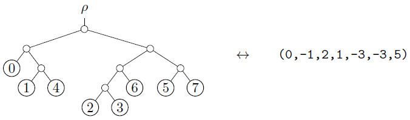

# Ordered leaf attachment (OLA) code

This repository contains an implementation of OLA encoding and decoding for phylogenetic tree topologies.
This is a method for representing a rooted, bifurcating tree as an integer vector, which records the sequence of leaf attachments in an ordered manner.

- The integer vector $(a_1, a_2, \ldots, a_{n - 1})$ must satisfy the simple condition $-i < a_i < i$ for every index $i$.

- The encoding is a bijection from trees to this convex set of "valid" integer vectors.

- The complexity is linear time in the number of leaves, for both encoding and decoding.




## Installation

Clone the repository and install using `pip`.

```shell
git clone https://github.com/matsengrp/ola-encoding.git
cd ola-encoding
python -m pip install .
```


## Basic usage

Convert an `ete3` tree into its OLA code.
The output is a python list of integers.

```python
>>> import ete3
>>> import ola

>>> tree = ete3.Tree("((0,(1,4)),(((2,3),6),(5,7)));")
>>> ola.to_vector(tree)  # [0, -1, 2, 1, -3, -3, 5]
```
By default, `ola.to_vector` assumes that the input tree has leaves named 0, 1, 2, ..., n-1.

Trees with arbitrary leaf names can be encoded, by sorting names in alphabetical order.
```python
>>> tree = ete3.Tree("(alice,((bob,carol),dave));")
>>> ola.to_vector(tree, alph_leaf_names=True)  # [0, 1, -2]
```
Convert an OLA code to its corresponding `ete3` tree.
```python
>>> vec = [0, -1, 2, 1, -3, -3, 5]
>>> tree = ola.to_tree(vec)
>>> print(tree)
#       /-0
#    /-|
#   |  |   /-1
#   |   \-|
#   |      \-4
# --|
#   |         /-2
#   |      /-|
#   |   /-|   \-3
#   |  |  |
#    \-|   \-6
#      |
#      |   /-5
#       \-|
#          \-7
```

Measure OLA distance between trees with the same number of leaves, and same leaf labels.
```python
>>> tree = ola.get_random_tree(100)
>>> tree_n = ola.random_tree_neighbor(tree)
>>> ola.ola_distance(tree, tree_n)  # 1

>>> tree_far = ola.get_random_tree(100)
>>> ola.ola_distance(tree, tree_far)  # ~95-100
```
